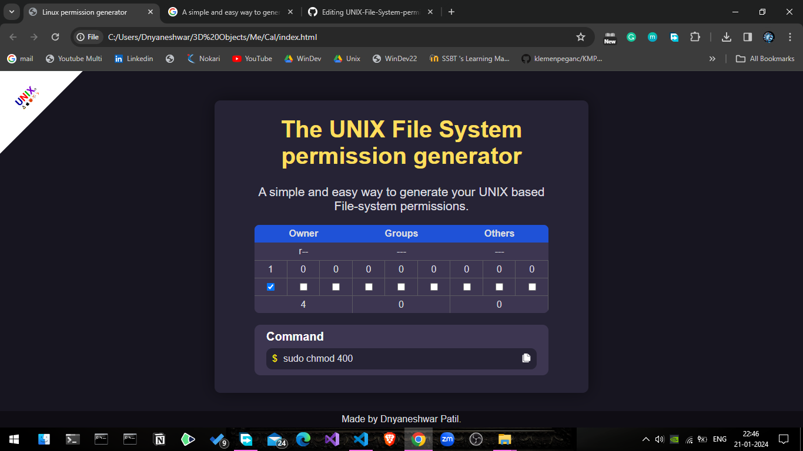

# The UNIX File System permission generator 

The Unix-like operating systems, such as Linux, MacOS, BSD unix, XINU ... running on shared high performance computers use settings called permissions to determine who can access and modify the files and directories stored in their file systems. Each file and directory in a file system is assigned "owner" and "group" attributes.

Permission:

R [4]	can read the file

W [2]  can write the file

X [1] can execute the file

command:

chmod 744 file_name

## Demo
https://dnyaneshwarit.github.io/UNIX-File-System-permission-generator/

## Preview Screenshots

